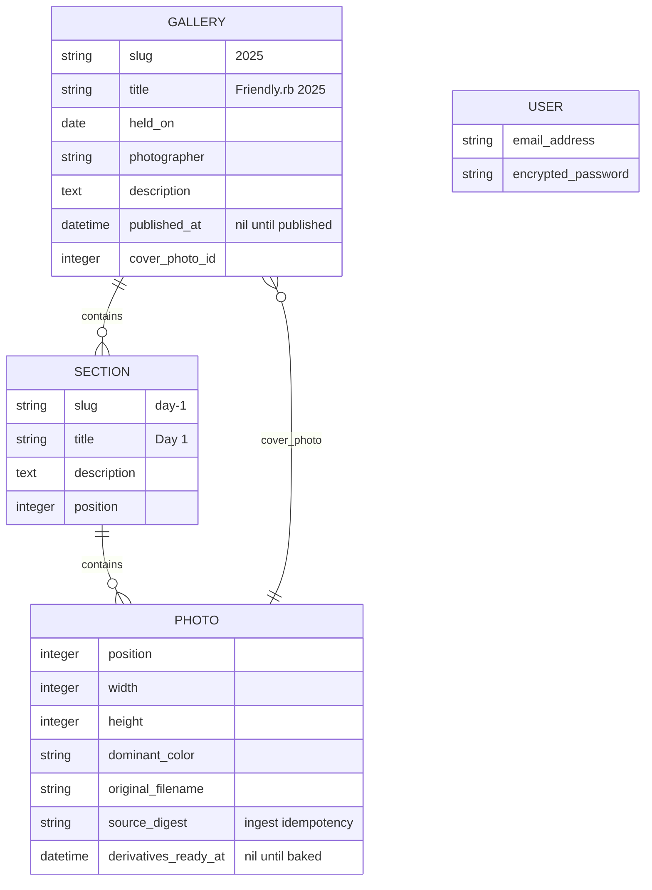
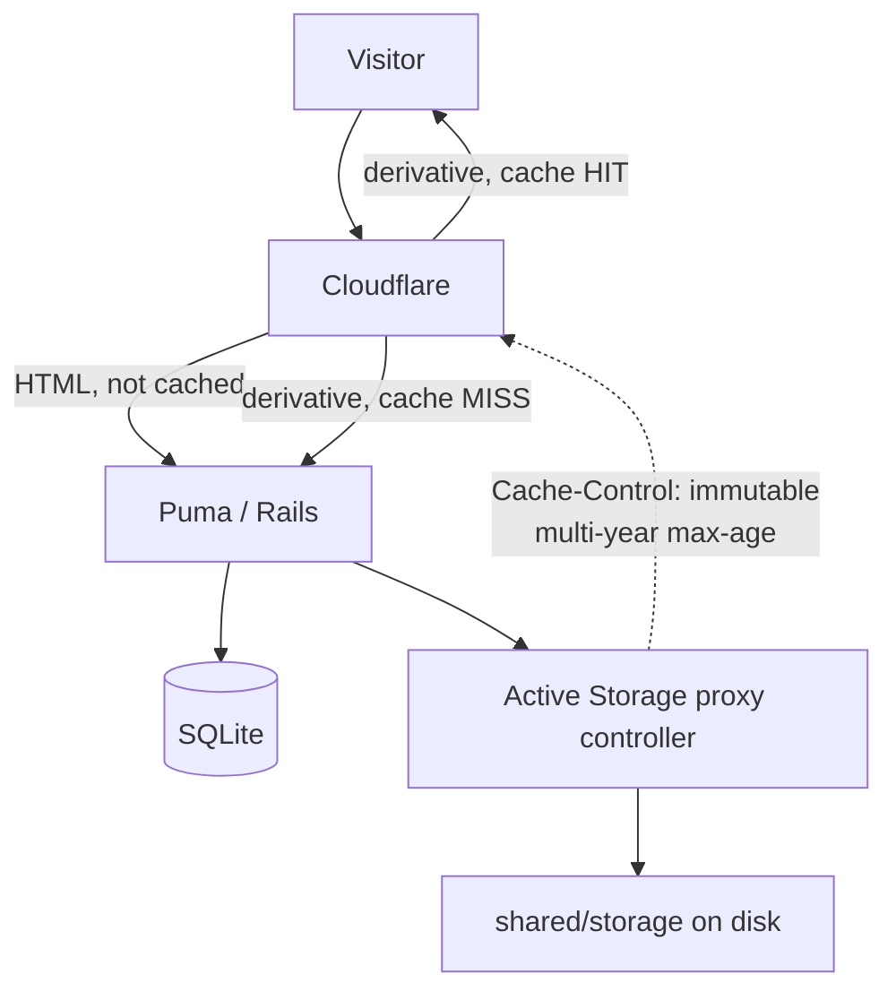
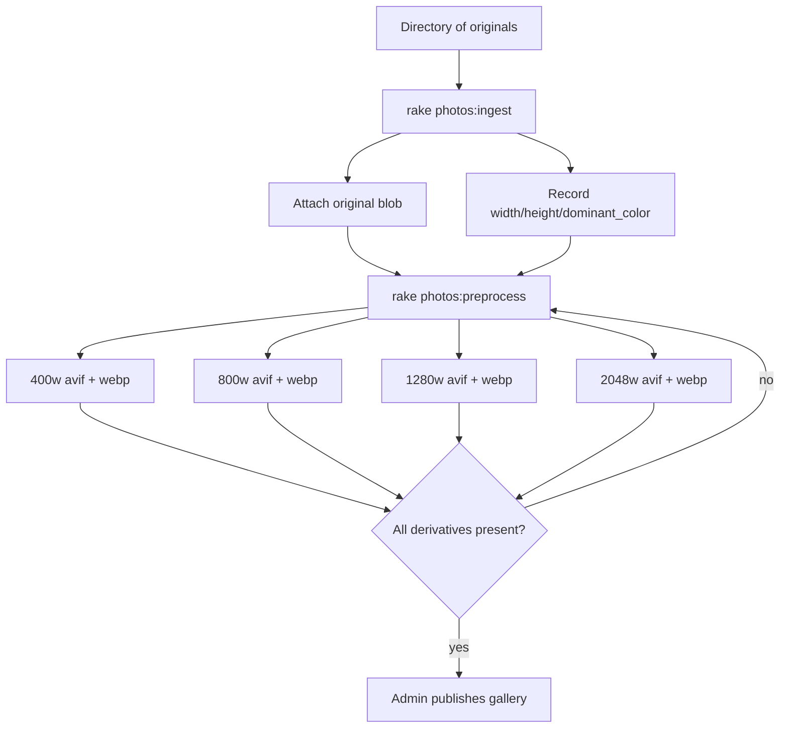

# Friendlyfolio Conference Photo Galleries - Plan

## Goal Capsule

- **Objective:** Ship a single-tenant Rails app that serves FriendlyRB's 2023, 2024 and 2025 conference photo galleries, replacing the hosted wfolio service at `friendlyrb.wfolio.pro`.
- **Scale it must carry:** 1,916 photos across 3 editions and 14 sections, ~15.4 GB of originals. Largest single section is 342 photos.
- **Authority hierarchy:** Requirements (R-IDs) govern product behavior. Key Technical Decisions (KTD-IDs) govern implementation mechanism within those requirements. Units override neither.
- **Execution profile:** Greenfield app, no existing code to preserve. Units are dependency-ordered and each lands as one commit. Photos arrive after install, so every unit must be verifiable with a handful of sample images.
- **Stop conditions:** Stop and surface rather than guess if (a) Hatchbox's shared-directory path differs from what U1 assumes, (b) variant pre-generation for the real 1,916-photo corpus exceeds the disk budget, or (c) Avo's Active Storage field cannot drive multi-file upload at the sizes involved.
- **Tail ownership:** Deploy configuration is in scope (U12); actually provisioning the Hatchbox app and uploading 15.4 GB of photos is not. Neither is the cutover: updating the three `friendlyrb.com` edition pages to point at the new galleries, and deciding when the wfolio subscription ends, are the team's calls and belong to whoever owns that site. The plan ships a replacement; it does not switch the traffic over.

---

## Product Contract

### Summary

Build `friendlyfolio`: a Rails 8.1 app on SQLite that hosts FriendlyRB's own conference photo galleries. Public visitors browse a gallery index, open an edition, scan a wall of photos grouped into sections, click any photo to zoom, download it, or copy a link to it. One admin signs in to manage galleries and ingest photos through Avo. The app serves AVIF/WebP derivatives behind immutable cache headers, is deployed on a single Hatchbox box, and carries no multi-tenant, billing, or client-proofing machinery.

### Problem Frame

FriendlyRB's conference photos live on wfolio, a hosted service built for photographers running client proofing. The team pays for and depends on a product whose centre of gravity is someone else's business model: favourites gated behind email capture, review harvesting, print ordering, face search. The conference gets a photo wall; the service gets lead generation.

The hosted galleries are also slower and less linkable than they need to be. Measured against the live site: thumbnails are JPEG-only with camera EXIF carried into every derivative, so a 640px tile costs 80.6 KB; one section request returns 2.75 MB of HTML for 342 tiles; a single photo cannot be linked to at all because the lightbox never changes the URL; and there is no page anywhere that lists the three editions, so a visitor needs the exact URL or a link from `friendlyrb.com`.

The photos are the conference's own record of itself. They should live somewhere the team controls.

### Actors

- A1. **Visitor** — anonymous, arrives from `friendlyrb.com` or a shared link. Browses, zooms, downloads, shares. Never authenticates.
- A2. **Admin** — one person (the team). Signs in to create galleries and sections, ingest photos, set covers and ordering.
- A3. **Ingest operator** — the same human as A2, working from a shell rather than the browser, running a rake task over a directory of thousands of files.

### Requirements

**Galleries and navigation**

- R1. A public index page lists every published gallery with its title, date, cover image, and photo count, newest first.
- R2. A gallery page shows a full-width cover image with the gallery title and date overlaid, followed by its sections.
- R3. A gallery contains ordered, named sections addressed by slug at `/<gallery-slug>/<section-slug>`; a gallery with exactly one section renders it without section chrome.
- R4. Each section carries an optional one-line description displayed above its photos.
- R5. Gallery URLs use the edition year as the slug (`/2023`, `/2024`, `/2025`) so links from `friendlyrb.com` need only a domain swap.

**Photo wall**

- R6. Each section renders its photos as a justified wall: variable-width tiles, uniform row height, no cropping, edge-to-edge rows.
- R7. The wall reserves each tile's exact space before any image byte arrives, producing zero cumulative layout shift.
- R8. Tiles below the fold load lazily; the first row loads eagerly at high priority.
- R9. The wall reflows to fewer, shorter rows at tablet and phone widths without a layout change.
- R10. A section over 300 photos paginates within the section, with each page addressable by URL. A deep link to any photo in the section resolves to the page containing it, and stepping past a page edge continues into the adjacent page rather than dead-ending.

**Zoom and navigation within a gallery**

- R11. Clicking a tile opens that photo at full viewport size over the wall.
- R12. The zoomed view supports next/previous by on-screen control, arrow key, and touch swipe, and closes by Escape, backdrop click, and an explicit close control.
- R13. The zoomed view is deep-linkable at a real route, `/<gallery-slug>/<section-slug>/photos/<id>`: opening a photo pushes that URL, and loading it directly opens the gallery with that photo already zoomed. With JavaScript unavailable the same URL renders a plain full-page photo view.
- R14. The zoomed view preloads the adjacent photos so stepping through the wall does not wait on the network.
- R15. The zoomed view is keyboard-operable and screen-reader-correct: focus moves into the dialog on open, is trapped while open, and returns to the originating tile on close.

**Download and share**

- R16. Every photo offers a download of the original file — GPS-stripped per R29, otherwise untouched — with a meaningful filename.
- R17. Every photo offers a "for sharing" download at 2048px as a JPEG — a format every operating system, messaging app and photo tool opens without thought.
- R34. Every route this app publishes for an unpublished gallery — page, photo, and download — is closed to an anonymous visitor, not merely unlinked. This does not extend to Active Storage URLs already handed out: the proxy controller verifies the signed blob id and knows nothing about publication, so a derivative URL captured while a gallery was public keeps working after it is unpublished. Unpublishing hides a gallery; it does not revoke bytes already given away. Treat publication as a one-way door, and do not rely on it to retract a photo.
- R18. Every photo offers a share control that copies its deep link to the clipboard and confirms visibly that it copied.
- R19. On a device with a native share sheet, the share control offers the sheet instead of a copy.
- R20. Gallery, section, and single-photo URLs carry OpenGraph and Twitter card tags with a real title, a real description, and a representative image.

**Admin and ingest**

- R21. Exactly one admin account exists. There is no public sign-up, no password reset by email, and no account management UI.
- R22. Everything a visitor sees is editable through Avo: galleries, sections, photos, ordering, covers, publication state.
- R23. A rake task ingests a directory tree of photos into a named gallery and section, is safe to re-run without duplicating, and reports progress.
- R24. A rake task pre-generates every derivative for a gallery, so no derivative is ever generated during a visitor's request.
- R25. A gallery is unpublished until explicitly published, so photos can be ingested and reviewed before anyone can reach them.

**Performance and delivery**

- R26. Wall and zoom images are served as AVIF with a WebP fallback; original-format bytes are served only for downloads.
- R27. Derivative URLs are permanent and carry immutable cache headers, so a CDN and the browser cache each derivative indefinitely.
- R28. A 100-tile wall view transfers under 1.5 MB of image bytes at 1x.
- R29. GPS coordinates are removed from originals at ingest, before any blob is created, so no file the app can hand out carries a location. Derivatives additionally carry no camera EXIF at all.
- R33. Derivatives preserve colour appearance: a photo delivered in a wide-gamut colour space does not render desaturated.

**Deployment**

- R30. The app deploys on Hatchbox as a single box with no external database, cache, or queue service.
- R31. The SQLite databases and the Active Storage files survive every deploy.
- R32. The SQLite database is registered for Hatchbox backups, and the restore path is documented.

### Key Flows

- F1. **Visitor browses to a photo**
  - **Trigger:** Visitor follows a link from `friendlyrb.com/edition-2025`.
  - **Actors:** A1
  - **Steps:** Lands on `/2025`; sees cover with title and date; scrolls into "Day 1"; wall renders with reserved tile space; scrolling loads further tiles and further sections; clicks a tile; photo opens full-screen and the URL becomes `/2025/day-1/photos/1234`.
  - **Outcome:** Visitor is looking at one photo at a shareable URL.
  - **Covered by:** R2, R3, R6, R7, R8, R11, R13

- F2. **Visitor shares one photo**
  - **Trigger:** Visitor presses Share in the zoomed view.
  - **Actors:** A1
  - **Steps:** On desktop the deep link is written to the clipboard and the control confirms "Copied"; on mobile the native share sheet opens with the same URL. A recipient opening that URL lands on the gallery with the photo already zoomed, and the link preview shows that photo.
  - **Outcome:** A photo-specific link that previews correctly.
  - **Covered by:** R13, R18, R19, R20

- F3. **Admin ingests an edition**
  - **Trigger:** A photographer delivers a directory of ~700 JPEGs organised into day-1/day-2/interviews folders.
  - **Actors:** A2, A3
  - **Steps:** Admin creates the gallery in Avo, unpublished. Runs the ingest task per section directory; it attaches each file, records dimensions and dominant colour, and reports progress. Runs the pre-generation task; every derivative is written before anyone visits. Admin sets the cover and section descriptions in Avo, reviews the unpublished gallery, publishes it.
  - **Outcome:** A published gallery whose every derivative already exists on disk.
  - **Covered by:** R22, R23, R24, R25

### Acceptance Examples

- AE1. **Deep link opens zoomed**
  - **Covers:** R13
  - **Given:** A published gallery `2025` with a section `day-1` containing photo 1234.
  - **When:** A visitor loads `/2025/day-1/photos/1234` directly with no prior session.
  - **Then:** The gallery renders and photo 1234 is open in the zoomed view, with next/previous positioned correctly within the section. With JavaScript disabled the same URL renders a full-page view of photo 1234.

- AE2. **Unpublished gallery is unreachable**
  - **Covers:** R25
  - **Given:** A gallery exists with `published_at` nil.
  - **When:** An anonymous visitor requests its URL or the index.
  - **Then:** The gallery URL returns 404 and the gallery does not appear on the index. A signed-in admin requesting the same URL sees it.

- AE3. **No derivative is built in-request**
  - **Covers:** R24
  - **Given:** A gallery whose pre-generation task has completed.
  - **When:** A visitor loads any wall or zoomed view.
  - **Then:** No variant-processing job runs and no libvips process is spawned during the request cycle.

- AE4. **Wall reserves space before images arrive**
  - **Covers:** R7
  - **Given:** A section of photos with mixed portrait and landscape orientations.
  - **When:** The page renders with image loading blocked.
  - **Then:** Every tile occupies its final position and size, and the measured cumulative layout shift after images load is 0.

- AE5. **Ingest is idempotent**
  - **Covers:** R23
  - **Given:** A section that already contains the photos from a directory.
  - **When:** The ingest task is run again over the same directory.
  - **Then:** No duplicate photo records are created and the task reports the files it skipped.

### Scope Boundaries

**In scope**

The visitor-facing gallery experience, the Avo admin behind Devise, the ingest and pre-generation tasks, the image pipeline, and the Hatchbox deploy configuration.

**Deferred to Follow-Up Work**

- **Bulk zip download of a whole section or gallery.** The reference offers this at three scopes, so its absence is the one genuine parity gap in this plan. It is deferred because building a 4.66 GB archive on a single box is an operational problem (disk headroom, request timeout, concurrent requests) that deserves its own decision rather than a guess inside this plan. Per-photo download (R16, R17) ships now.
- **Photo-level metadata display** — capture date, camera, lens. The data is in the originals; nothing in the reference surfaces it.
- **Search or filtering within a gallery.**
- **Multiple admin accounts or roles.**

**Outside this product's identity**

- Client proofing in any form: favourites, selections, email capture, review or testimonial collection, per-photo comments.
- Commerce: print ordering, carts, pricing.
- Face detection or people search.
- Watermarking and right-click protection. The photos are meant to be downloaded.
- Any notion of a second tenant: customer accounts, sign-up, organisations, plans, per-customer branding.
- Password-protected or expiring gallery links.

### Sources

- Live reference, observed 2026-09-19: `friendlyrb.wfolio.pro/disk/2023|2024|2025`. Photo counts, byte sizes, layout measurements, and the feature inventory in this document are measured from it, not assumed.
- `friendlyrb.com` repo (Jekyll + Tailwind v4): brand tokens and the existing links into the wfolio galleries.
- Rails 8.1.3.1 source, `activestorage/lib/active_storage/service/disk_service.rb` and `ActiveStorage::Streaming`: the serving-mode findings behind KTD6 and KTD7.
- Hatchbox docs: SQLite article, Active Storage article, build/deploy scripts article.

---

## Planning Contract

### Key Technical Decisions

- KTD1. **Rails 8.1.3.1 on SQLite, generated with `--no-rc`.** (session-settled: user-directed — chosen over PostgreSQL: the app must be self-contained on one Hatchbox box with no external database service.) The `--no-rc` flag is load-bearing, not cosmetic: the machine's `~/.railsrc` contains `--css tailwind --js esbuild --database postgresql`, so omitting it silently produces a PostgreSQL app with an esbuild pipeline. Generate with `--no-rc --database=sqlite3 --skip-docker --skip-kamal --skip-action-mailbox --skip-action-text --skip-action-cable --skip-jbuilder --skip-thruster --skip-ci`. (`--skip-devcontainer` is unnecessary in 8.1 — devcontainer files are already opt-in.)

- KTD2. **Keep Solid Queue and Solid Cache; drop Solid Cable.** `--skip-solid` is all-or-nothing, so use `--skip-action-cable` to remove the cable database while keeping the queue and cache. Solid Queue is needed because Active Storage's analyze and preprocess jobs need a real backend (KTD9), and both store into SQLite files alongside the main database, which costs nothing operationally.

- KTD3. **Devise for the single admin, with `:registerable` omitted.** (session-settled: user-directed — chosen over Rails 8's built-in authentication generator: Devise is the team's standard and integrates with Avo through a documented one-line pattern.) Enable `:database_authenticatable`, `:rememberable`, `:validatable` only. Routes are declared with `devise_for :users, skip: [:registrations, :passwords]` so no sign-up or reset surface exists. The single admin is created by `db:seed` from credentials, not by a form.

- KTD4. **Avo 4 for the entire admin, mounted inside a Devise `authenticate` block.** (session-settled: user-directed — chosen over hand-rolled admin controllers: the admin is CRUD over four models and writing it by hand is strictly more code to maintain.) `config.current_user_method = :current_user` in the initializer, and `authenticate :user do mount_avo end` in routes so an unauthenticated request never reaches Avo at all. Avo pulls `view_component` and `pagy` transitively; that is the accepted cost of the decision.

- KTD5. **Justified flexbox rows for the photo wall, not masonry.** The reference uses JS-positioned masonry. Justified rows give uniform row heights with no cropping and need zero JavaScript, producing zero layout shift because each tile's width derives from its stored aspect ratio at render time. The mechanism is `flex: var(--r) 1 calc(var(--r) * var(--h))` on each tile, where `--r` is the aspect ratio and `--h` the target row height; widths then come out exactly proportional to aspect ratio, so every tile in a row resolves to the same height and the row justifies flush. The non-zero flex-basis is the load-bearing part: the commonly published `flex: var(--r) 1 0` never wraps, because a zero basis never exceeds the container. `column-count` was rejected outright — it fills column-major, which scrambles the chronology of a conference day and cannot be fixed. Native CSS masonry (`grid-lanes`) is still Baseline limited and not shippable.

  **Fallback if the justified last-row handling becomes a time sink:** a fixed-ratio CSS grid, quantising each photo to one of three ratios with `object-fit: cover`. Still zero-JS and zero-CLS, much simpler — but it *crops*, and conference photos with people near the frame edge get beheaded. Taking it therefore means amending R6, which forbids cropping; it is a scope change to raise, not a silent substitution an implementer can make alone.

  This makes Active Storage's image analyzer a hard dependency of the layout: no stored width and height means no ratio, no reserved space, and the layout shift comes back. Do not disable it.

- KTD6. **Active Storage proxy mode for display bytes, redirect mode for downloads.** Set `config.active_storage.resolve_model_to_route = :rails_storage_proxy` globally. Rails 8.1's representation proxy controller already wraps responses in `http_cache_forever public: true`, yielding `Cache-Control: max-age=3155695200, public, immutable` on URLs that never change — exactly the CDN-friendly stable URL this plan needs, with no configuration. Downloads override to `rails_storage_redirect_path(..., disposition: "attachment")`, because streaming a 5 MB original through proxy mode pins a Puma thread for the duration, whereas the redirect hands off to `Rack::Files` which releases it faster and supports range requests.

- KTD7. **A CDN in front is load-bearing, not an optimisation.** `public: true` on a Disk service does *not* produce a URL that bypasses Rails — it only drops the expiry from the signed token; the URL still routes to `ActiveStorage::DiskController`. And proxy mode streams through `ActionController::Live`, so `X-Sendfile` cannot help it. Hatchbox fronts apps with Caddy, not nginx, so `X-Accel-Redirect` is unavailable regardless. The consequence: with no CDN, this box serves every byte of every wall view forever. Cloudflare's free tier honours origin `Cache-Control` and includes tiered caching, which reduces the origin to roughly one request per derivative for all time. Two rules follow and must not be violated: never set `config.active_storage.urls_expire_in` (it makes every render emit a different URL, giving zero cache hits and caching URLs that later 404), and never rotate `secret_key_base` (it invalidates every cached derivative URL and every link anyone has shared).

- KTD8. **AVIF with a WebP fallback via `<picture>`; no JPEG tier for display.** AVIF reached Baseline "widely available" on 2026-07-25 and sits at ~95% global support; WebP has been widely available since 2023 and is smaller than JPEG, so it is the right `` fallback and a third JPEG tier buys nothing but encode time and disk. Four display sizes per photo — 400w and 800w for the wall, 1280w and 2048w for zoom — in two formats each, at AVIF `Q:50 effort:4` and WebP `Q:72` for wall sizes, `Q:52`/`Q:78` for zoom sizes. A ninth derivative, 2048w JPEG at quality 80, exists for the two places a modern format is a liability rather than an asset: the "for sharing" download (R17), where the recipient's tool has to open it, and `og:image` (R20), where link unfurlers on Slack, LinkedIn and X will simply render nothing for an AVIF. Nine derivatives per photo, ~17,250 files for the full corpus. Two candidates per format is the right number, not four — a new breakpoint earns its place roughly every 20 KB of growth, and these sizes do not justify more. `sizes` must be written on every `<source>` as well as the ``: `<source>` does not inherit it, and omitting it silently means `100vw` and a 4x byte overdraw on a page that looks entirely correct. Because a justified wall's tile widths vary per row, no exact `sizes` exists — use conservative per-breakpoint `vw` estimates and accept an occasional one-step over-fetch (`sizes="auto"` would solve it exactly but is Baseline limited). Add `image/avif` and `image/webp` to `config.active_storage.web_image_content_types` so Active Storage does not force-convert to PNG.

- KTD9. **Every derivative is pre-generated; none is ever built in a request — and the bulk bake does not go through the job queue.** `ActiveStorage::Representations::BaseController#set_representation` calls `.processed` in a `before_action`, and both the proxy and redirect controllers inherit it, so a variant that does not yet exist is generated *synchronously inside the Puma request*. On a cold 100-tile wall that is 100 concurrent libvips invocations inside the web workers. Two different mechanisms follow, and conflating them is the trap: `preprocessed: true` cannot express this split and must not be used. It is a property of the attachment declaration, not the call site — Active Storage runs `transform_variants_later` in an `after_create_commit` on every attach, so declaring it would enqueue nine jobs per photo, roughly 17,250 across the import, with no way for the bulk path to opt out. Baking is driven explicitly instead: one job per photo for a single admin upload, and inline under the rake task's own worker pool for the import, which suppresses the enqueue rather than queueing work it is about to do itself. R24 and AE3 exist to hold this line.

  The invariant also has to survive publication. A photo added through Avo to an already-published gallery is live the moment it is attached, while its nine transform jobs are still queued — so the next visitor triggers exactly the synchronous generation this decision exists to prevent. New photos are therefore withheld from public rendering until their derivatives exist, rather than trusting the queue to win the race.

- KTD15. **Bake derivatives locally and `rsync` them up; do not encode 1,916 photos on the production box.** AVIF encoding dominates the pipeline by roughly an order of magnitude, putting the full corpus at an estimated 25 minutes to 2 hours of saturated CPU depending on core count. That is a one-shot cost against a corpus that is already sitting on someone's laptop, and running it on a 2-vCPU box competes with Puma and risks an OOM with several 24-megapixel images in flight. Ingest and bake locally, then move **both halves** to the server: the files under `storage/` *and* the database rows that describe them. Active Storage splits its state — blobs and attachments and variant records live in SQLite, the bytes live on disk — and copying only the files gives a server that cannot see any of them. Since the whole database is a file inside the same `storage/` tree, one transfer can carry both, but it means the production database is *replaced* by the bake, not merged into. That is fine for the initial import and wrong for every later one, so the runbook must say which situation it is describing. This also means libvips concurrency needs deciding once: libvips already parallelises within each operation, so either set `VIPS_CONCURRENCY=1` and run several Ruby workers, or leave vips threading alone and run one or two — doing both oversubscribes the machine.

- KTD10. **Store `width`, `height`, and `dominant_color` as columns on `Photo`.** The wall cannot reserve tile space without knowing each photo's aspect ratio at render time, and reading it from Active Storage metadata per tile is an N+1 across `active_storage_blobs`. Dominant colour fills the tile before its image arrives — a one-call vips operation at ingest, and the cheapest placeholder that needs no extra gem and no extra request. Blurhash and LQIP were rejected: both need a gem or an inline payload, for a perceptual gain that is small when tiles are already 8-14 KB and lazily loaded.

- KTD11. **Strip GPS from the originals at ingest, strip everything from derivatives, keep the colour profile, and carry photographer credit as data.** Three distinct moves that are easy to collapse into one and get wrong:
  - *Originals:* the download button hands out the photographer's file verbatim, so stripping derivatives alone leaves attendee location data in the one file a visitor actually keeps. Remove GPS from the source files once, offline, before blobs are created — `exiftool -gps:all=` is lossless, runs outside the deployed app, and leaves copyright and artist tags intact.
  - *Derivatives:* strip all metadata. vips bakes EXIF orientation into the pixels during the resize and removes the orientation tag itself, so there is no tag left for stripping to lose and images cannot come out sideways. Metadata carried into derivatives is a large part of why the reference's 640px thumbnails cost 80.6 KB.
  - *Colour:* stripping also drops the ICC profile, which makes an Adobe RGB or Display P3 original render visibly desaturated once the browser assumes sRGB (R33). Either convert to sRGB explicitly before saving or keep the ICC profile; decide which against the installed libvips and verify on one wide-gamut file.

  The GPS guarantee has to hold on **every** path a photo can enter by, not just the rake task. A photo attached through Avo never passes through the ingest step, so the stripping belongs on the model — an attach-time hook that removes GPS from the original regardless of who attached it — with the rake task's `exiftool` pass as a bulk optimisation ahead of it, not as the only guard.

  Credit is data, not metadata: the reference's EXIF copyright field is the *only* photographer credit it has, so a `photographer` field on `Gallery`, rendered in the footer, replaces what stripping removes.

- KTD12. **Sections are the unit of both grouping and pagination.** Each section renders as its own flex container, so rows never straddle a section boundary and chronology is preserved. The first section renders inline; later sections render as lazy Turbo Frames, which gives intersection-triggered loading and a real URL per section with zero custom JavaScript. Within a section, render all tiles up to 300 and paginate beyond it — the reference returns 2.75 MB of HTML for its 342-tile section, which is the failure mode to avoid. One real section exceeds the threshold — 2024 day-1 at 342 — and 2023 day-1 sits just under it at 299, which is close enough that the threshold should not be treated as finely tuned.

- KTD13. **Tailwind via `tailwindcss-rails`, matching friendlyrb.com's tokens.** The conference site is Tailwind v4 on `blue-900` primary, `yellow-500` accent, Work Sans body and Sora headings. `tailwindcss-rails` ships a standalone binary and needs no npm or Node, so it satisfies the minimal-dependency constraint while making the gallery look like it belongs to the conference. (session-settled: user-directed — chosen over a JS-framework or component-library stack: the app must stay self-contained and deployable on one box.)

- KTD14. **Native `<dialog>` plus one Stimulus controller for the lightbox.** `<dialog>` gives focus trapping, Escape-to-close, backdrop, and the top layer for free — the accessibility requirements in R15 are mostly satisfied by the element itself rather than by hand-written code. The controller adds arrow keys, swipe, adjacent-image preload, and History API deep-linking. This replaces PhotoSwipe (what the reference uses) with roughly a hundred lines and no dependency.

### High-Level Technical Design

Domain model. A gallery is an edition; a section is a named, ordered group within it; a photo belongs to a section and carries its own derived dimensions.



Request path for a wall view, showing where bytes come from. The point of the diagram is that after warm-up, the only thing the Rails box does is render HTML.



Ingest and pre-generation, kept deliberately off the request path.



The justified-wall geometry, since it is the least obvious decision in the plan. Each tile's flex basis is proportional to its aspect ratio, so distributing free space along the same proportion leaves every tile in a row at the same height:

```text
tile width = r_i * (h + free_space / sum_of_r_in_row)
```

which is `h * r_i` plus a share of the leftover proportional to `r_i` — uniform height by construction, no cropping, no JavaScript.

### Assumptions

- Hatchbox symlinks a shared `storage/` directory into every release, so the Rails 8 default of placing both the SQLite databases and the Active Storage root under `storage/` persists across deploys without configuration. Hatchbox's own Rails 8 guidance on SQLite is "you don't have to do a thing". U1 and U12 assume this; U12 verifies it on the real box before anything depends on it.
- The absolute shared path is assumed to follow `/home/deploy/<app>/shared/storage/` for the purpose of registering the database for backups. The exact prefix is read off the running box rather than trusted from this plan.
- Photos arrive as high-resolution JPEGs organised in per-section directories, matching the reference's structure. Ingest handles a flat directory too, but section assignment is then a task argument.
- Derivative storage is budgeted at roughly 9-14 GB on top of the 15.4 GB of originals, from ~17,250 derivative files. Measured against 20 real photos in U3 before the full corpus is processed.
- Full-corpus pre-generation measures 12.3s per photo for all nine variants on a 10-core laptop — about 6.5 hours for 1,916 photos, dominated by AVIF, with the 2048px AVIF alone accounting for 6s of it. It runs once per edition, on a laptop rather than the server (KTD15), and is restartable — so its wall-clock is an operational note rather than a design constraint. If that is too slow, the variant ladder (KTD8) is the lever.

### Sequencing

**Verify the Hatchbox shared-storage layout before U1, not at U12.** U1's database and storage paths, U3's derivative locations, and U10's entire bake-and-transfer strategy all rest on an assumption taken from documentation. Confirming it takes minutes on a provisioned box; discovering it is wrong after twelve units are built is a rewrite of the deployment story. U12 is where the deploy is *configured*, not where this assumption should first be tested. The `storage/db` and `storage/files` split is the specific thing to check, since the documentation describes the default flat layout rather than this one.

U1 through U3 build the foundation — app, model, image pipeline — and nothing visitor-facing works until U3 lands. U4 and U5 make the admin usable, which is what makes U10's ingest reviewable. U6 through U9 are the visitor experience and are the only units a visitor ever sees. U10 is what makes the app useful with real data. U11 and U12 are what make it fast and deployable. U6 can proceed in parallel with U4/U5 if two people are working, since they share only the model.

---

## Implementation Units

### Unit Index

| U-ID | Title | Key files | Depends on |
|---|---|---|---|
| U1 | App skeleton, SQLite, Hatchbox-ready config | `config/database.yml`, `config/storage.yml`, `Gemfile` | — |
| U2 | Gallery, Section, Photo model | `app/models/`, `db/migrate/` | U1 |
| U3 | Image pipeline: variants, EXIF, dimensions | `app/models/photo.rb`, `config/initializers/active_storage.rb` | U2 |
| U4 | Devise single-admin authentication | `app/models/user.rb`, `config/routes.rb`, `db/seeds.rb` | U1 |
| U5 | Avo admin resources | `app/avo/resources/`, `config/initializers/avo.rb` | U3, U4 |
| U6 | Gallery index and show pages | `app/controllers/galleries_controller.rb`, `app/views/galleries/` | U3 |
| U7 | Justified photo wall | `app/views/sections/`, `app/assets/stylesheets/` | U6 |
| U8 | Lightbox with deep-linking | `app/javascript/controllers/lightbox_controller.js` | U7 |
| U9 | Download and share controls | `app/controllers/photos_controller.rb`, `app/javascript/controllers/share_controller.js` | U8 |
| U10 | Bulk ingest and pre-generation tasks | `lib/tasks/photos.rake` | U3 |
| U11 | Caching, OG tags, CDN posture | `app/views/layouts/`, `config/environments/production.rb` | U6, U9 |
| U12 | Hatchbox deploy configuration and backups | `.hatchbox/`, `README.md` | U1, U10 |

---

### U1. App skeleton, SQLite, and Hatchbox-ready configuration

**Goal:** A Rails 8.1.3.1 app that boots on SQLite in development and has a production configuration that will survive a Hatchbox deploy.

**Requirements:** R30, R31

**Dependencies:** none

**Files:**
- `Gemfile`, `Gemfile.lock`
- `config/database.yml`
- `config/storage.yml`
- `config/queue.yml`
- `config/environments/production.rb`
- `.ruby-version`
- `test/` scaffolding

**Approach:**

1. Generate with `rails new . --name=friendlyfolio --no-rc --database=sqlite3 --skip-kamal --skip-docker --skip-thruster --skip-jbuilder --skip-action-mailbox --skip-action-text --skip-action-cable --skip-ci`. The `--no-rc` guard is mandatory — without it the machine's `~/.railsrc` forces PostgreSQL and esbuild (KTD1). `--skip-action-cable` is what drops `solid_cable` without taking Solid Queue and Solid Cache with it (KTD2). Do *not* pass `--skip-system-test`: U7, U8 and U9 depend on system tests. Do not pass `--skip-git` either — the generated `.gitignore` is wanted, and re-initialising over the existing repo is harmless.
2. Uncomment and fill the production database paths in `config/database.yml`. `--skip-docker` leaves them commented, and the app will not boot in production until they are set. Keep three separate databases — primary, cache, queue — rather than collapsing them: Solid Queue's dispatcher polls constantly, and keeping that write traffic off the primary's write-ahead log is the whole point on a database that serialises writers.
3. Split the shared directory by backup economics: databases under `storage/db/`, Active Storage files under `storage/files/`. Both sit inside the one directory Hatchbox symlinks, so this costs nothing and needs no extra deploy step — but the database is small and backed up by Hatchbox while the blobs are ~15 GB and are not, and separating them makes that difference visible instead of buried.
4. Do not hand-write SQLite pragmas. Rails 8.1's adapter already sets WAL, `synchronous: normal`, a 128 MB mmap, foreign keys, immediate transaction mode, and a busy handler that releases the GVL while waiting — which is what makes multiple Puma workers safe against SQLite. Note the 8.1 rename of `pool:` to `max_connections:`; setting both to different values raises at boot.
5. Add `tailwindcss-rails` (KTD13) and wire the brand tokens: `blue-900` primary, `yellow-500` accent, Work Sans body, Sora headings.
6. Add `image_processing` — note it resolves to 1.14.0 under the generated `~> 1.2` pin, not the 2.x on RubyGems; do not loosen the pin without testing.
7. Set `config.active_storage.variant_processor = :vips` explicitly rather than relying on the default, and extend `web_image_content_types` per KTD8.
8. Verify libvips on this machine can actually encode AVIF before U3 depends on it — it needs libheif, and its absence would otherwise surface as a confusing variant failure.

**Patterns to follow:** Rails 8.1 generated defaults throughout. Do not restructure what the generator produces.

**Test scenarios:**
- Booting in the development environment connects to SQLite and runs a migration successfully.
- `RAILS_ENV=production` with a dummy `SECRET_KEY_BASE` boots without raising on a missing database configuration — the regression guard for the commented-paths trap.
- The Tailwind build produces a stylesheet containing the brand colour tokens.

**Verification:** `bin/rails about` reports Rails 8.1.3.1 on SQLite. `config/database.yml` has no commented-out production stanza. A production-environment boot does not raise.

---

### U2. Gallery, Section, and Photo model

**Goal:** The domain model, with slugs, ordering, and publication state.

**Requirements:** R3, R5, R25

**Dependencies:** U1

**Files:**
- `db/migrate/*_create_galleries.rb`, `*_create_sections.rb`, `*_create_photos.rb`
- `app/models/gallery.rb`, `app/models/section.rb`, `app/models/photo.rb`
- `test/models/gallery_test.rb`, `test/models/section_test.rb`, `test/models/photo_test.rb`

**Approach:**

1. `Gallery`: `slug` (unique, indexed), `title`, `held_on`, `photographer`, `description`, `published_at` (nullable), `cover_photo_id`. Slug is the edition year per R5.
2. `Section`: belongs to gallery, `slug` (unique per gallery, compound index), `title`, `description`, `position`.
3. `Photo`: belongs to section, `position`, `original_filename`, plus the derived columns added in U3.
4. Ordering is an explicit integer `position` on both section and photo, not an implicit `created_at` — ingest order should not be the only thing standing between the team and a sensible sequence.
5. `Gallery.published` scope on `published_at IS NOT NULL`. Use it as the default for all public-facing lookups so an unpublished gallery is unreachable by construction rather than by remembering to filter (AE2).
6. Slugs are the route parameter: override `to_param`.

**Test scenarios:**
- A gallery with a duplicate slug is rejected.
- Two sections in different galleries may share a slug; two in the same gallery may not.
- The `published` scope excludes a gallery with nil `published_at` and includes one with a timestamp.
- Photos come back in `position` order, not insertion order.
- Deleting a gallery deletes its sections and photos, and does not leave orphaned attachments.
- A gallery whose `cover_photo` is deleted does not raise on render — the cover falls back to the first photo.

**Verification:** Model tests pass. A gallery, section, and photo can be created and traversed in the console, and an unpublished gallery is absent from `Gallery.published`.

---

### U3. Image pipeline: variants, EXIF handling, and derived dimensions

**Goal:** One attached original per photo, nine declared derivatives, and the dimension and colour columns the wall depends on.

**Requirements:** R26, R28, R29, R33, and the precondition for R7

**Dependencies:** U2

**Files:**
- `db/migrate/*_add_dimensions_to_photos.rb`
- `app/models/photo.rb`
- `config/initializers/active_storage.rb`
- `test/models/photo_variants_test.rb`
- `test/fixtures/files/` — a handful of real sample photos including one portrait and one with EXIF orientation set

**Approach:**

1. Add `width`, `height`, `dominant_color` to `photos` (KTD10). All three are populated at attach time, not read per-render.
2. Declare the attachment with nine named variants, all `preprocessed: true` for the ongoing single-upload case (KTD9): 400w and 800w in AVIF and WebP for the wall; 1280w and 2048w in AVIF and WebP for zoom; and 2048w JPEG at quality 80 for the sharing download and `og:image`. Quality per KTD8 — AVIF `Q:50 effort:4` for wall sizes, `Q:52` for zoom; WebP `Q:72` and `Q:78`. Leave chroma subsampling on auto.
3. Strip metadata on every variant while preserving colour appearance (KTD11, R33). vips applies EXIF orientation during the resize, so the stripped output is already correctly rotated — the portrait and EXIF-rotated fixtures exist to prove this rather than assume it. Decide the ICC handling against the installed libvips and verify it on one wide-gamut file; the exact option name differs across libvips versions, so read it rather than copying a snippet.
4. Extract `dominant_color` in one vips call at attach: resize to 1x1 and read the pixel. Width, height, dominant colour and GPS stripping all hang off the **attachment**, not off the ingest task — otherwise a photo added through Avo arrives with no dimensions (so the wall cannot reserve its space) and with its GPS intact. One code path, both entry points.
5. Add `aspect_ratio` as a method over the stored columns, rounded to 4 decimal places — this is what the wall template interpolates.
6. Set `config.active_storage.resolve_model_to_route = :rails_storage_proxy` (KTD6). Explicitly do *not* set `urls_expire_in` (KTD7); add a comment in the initializer saying why, because a future reader will otherwise be tempted.

**Execution note:** Verify the byte targets against ~20 real photos before the full corpus is committed to. KTD8's per-variant estimates (8-14 KB at 400w AVIF, 150-250 KB at 2048w) drive the storage budget in Assumptions; if real numbers differ materially, the variant ladder is the thing to adjust.

**Test scenarios:**
- Attaching a landscape photo records width, height, and a valid hex `dominant_color`.
- A photo whose EXIF specifies a 90-degree rotation records the *rotated* dimensions, and its generated variant is visually upright.
- A generated variant contains no EXIF: specifically no GPS block and no camera make/model.
- The original blob carries no GPS block, because ingest removed it from the source file (R29). Its other metadata — copyright, artist, camera — is intact, since stripping GPS must not cost attribution.
- A wide-gamut source photo produces a derivative that still renders with correct saturation rather than washing out under an assumed sRGB profile (R33).
- All nine named variants are declared and each resolves to a distinct variation key.
- `aspect_ratio` on a 3000x2000 photo returns 1.5.
- A photo attached with an unsupported content type is rejected rather than stored.

**Verification:** Variant files appear on disk after attach with the job backend running. Measured byte sizes for the sample set are recorded and sit within the KTD8 ranges, or the ladder is adjusted and the plan's assumption updated.

---

### U4. Devise single-admin authentication

**Goal:** One admin can sign in; nobody can sign up.

**Requirements:** R21

**Dependencies:** U1

**Files:**
- `app/models/user.rb`
- `db/migrate/*_devise_create_users.rb`
- `config/initializers/devise.rb`
- `config/routes.rb`
- `db/seeds.rb`
- `test/integration/authentication_test.rb`

**Approach:**

1. Install Devise with `:database_authenticatable, :rememberable, :validatable` only (KTD3). No `:registerable`, no `:recoverable`, no `:confirmable`, no `:trackable` — there is no mail delivery configured, no second user to invite, and nothing that reads sign-in statistics. Dropping `:registerable` is what actually removes the routes; the `skip:` in the route declaration documents the intent.
2. Pin Devise at 5.0.4 or later. 5.0.3 and earlier carry two fixed advisories — a confirmable race condition and an open redirect in `FailureApp` via an unvalidated `Referer` — and neither is worth inheriting for a version pin that costs nothing.
3. `devise_for :users, skip: [:registrations, :passwords]` so the routes do not merely redirect but do not exist.
4. Seed the admin from `ADMIN_EMAIL` and `ADMIN_PASSWORD` environment variables via `find_or_create_by!`, so re-running seeds neither fails nor resets the password. Password rotation is a console operation, not a form.
5. Leave the generated `config.responder.error_status` alone. Rails 8.1 on Rack 3.1+ generates `:unprocessable_content` because Rack deprecated the older spelling, and this is what makes a failed sign-in re-render its errors under Turbo instead of swallowing them. Do not "correct" it back.
6. Throttle repeated failed sign-in attempts. One admin account on the public internet, with no lockout and the entire admin surface behind it, is a password-guessing target that nothing else in this app mitigates.
7. Name the production secrets this app needs in one place: `SECRET_KEY_BASE`, `ADMIN_EMAIL`, `ADMIN_PASSWORD`. `SECRET_KEY_BASE` in particular is load-bearing beyond authentication — it signs every derivative URL (KTD7).

**Test scenarios:**
- Correct credentials sign in and land on the admin.
- Incorrect credentials re-render the sign-in form with an error, at a status Turbo renders.
- `GET /users/sign_up` returns 404, not a redirect — the route genuinely does not exist.
- `GET /users/password/new` returns 404.
- Running `db:seed` twice creates exactly one user and does not alter the existing password.
- An unauthenticated request to an admin path redirects to sign-in.
- Repeated failed sign-in attempts from one source are throttled rather than accepted indefinitely.

**Verification:** Signing in works; sign-up and password-reset paths 404; seeds are idempotent.

---

### U5. Avo admin resources

**Goal:** Everything a visitor sees is editable through Avo, behind the admin login.

**Requirements:** R22, R25

**Dependencies:** U3, U4

**Files:**
- `config/initializers/avo.rb`
- `app/avo/resources/gallery.rb`, `section.rb`, `photo.rb`, `user.rb`
- `config/routes.rb`
- `test/integration/admin_access_test.rb`

**Approach:**

1. `config.current_user_method = :current_user` in the Avo initializer (KTD4).
2. Mount inside `authenticate :user do mount_avo end` so an unauthenticated request never reaches Avo's middleware at all.
3. Gallery resource: slug, title, held_on, photographer, description, published_at, cover photo selector, and its sections. Publication is a visible, deliberate field — not a checkbox buried in a panel.
4. Section resource: gallery, slug, title, description, position, and its photos.
5. Photo resource: the image field, position, original filename. Dimensions and dominant colour are displayed read-only — they are derived, and an editable field implying otherwise would be a lie.
6. **U10's rake task is the ingest path; Avo is the curation path.** Avo Community's bulk multi-attachment behaviour is unverified, and the paid `avo-advanced_file_uploads` add-on exists precisely in that space — so do not design the 1,916-photo workflow around a browser upload. Verified against the rendered form: Avo Community's `:file` field emits no `multiple` attribute, so the admin can attach exactly one photo per round trip. That is fine for a correction and unusable for a bulk import, so the rake task is the only ingest path. `:files` is the wrong shape regardless — it maps to `has_many_attached` on one record, and each photo needs its own row.

**Test scenarios:**
- An unauthenticated request to the Avo mount point redirects to sign-in and does not render any Avo markup.
- A signed-in admin can create a gallery, add a section, and attach a photo.
- Editing `published_at` from the admin changes the gallery's visibility on the public index.
- A photo added to an already-published gallery does not render publicly until its derivatives exist (KTD9), so a visitor never triggers variant generation mid-request.
- Reordering sections by position is reflected on the public gallery page.
- Derived fields are not editable through the admin form.

**Verification:** The admin covers every field the public pages read. A gallery can be taken from creation to published entirely through Avo.

---

### U6. Gallery index and show pages

**Goal:** The two public pages that frame everything else.

**Requirements:** R1, R2, R3, R4, R5

**Dependencies:** U3

**Files:**
- `app/controllers/galleries_controller.rb`
- `app/views/galleries/index.html.erb`, `show.html.erb`
- `app/views/sections/_section.html.erb`
- `config/routes.rb`
- `test/integration/galleries_test.rb`

**Approach:**

1. Routes: `/` for the index, `/:gallery_slug` for a gallery, `/:gallery_slug/:section_slug` for a section. Constrain the gallery slug so the route does not swallow `/users/sign_in` or the Avo mount.
2. Index lists published galleries newest-first with cover, title, date, and photo count (R1). This page has no counterpart in the reference — there is currently no way to reach the list of editions from anywhere on wfolio — so it is the one place to design rather than match.
3. Gallery show renders a full-viewport cover with title and date overlaid, matching the reference's strongest visual move, then the section navigation, then the sections themselves. Overlaid text on an arbitrary photo is a contrast problem, not a styling preference: a scrim or gradient behind the text is required so the title stays legible over a bright cover, and the treatment has to hold for whichever photo the admin picks rather than for the one it was designed against.
4. Section navigation is a horizontal row of links to each section, mirroring the reference. It needs a current-section state, has to stay usable when five sections do not fit a phone's width, and — because sections load lazily — should move the viewport to a section that may not have rendered yet.
4. A gallery with exactly one section renders it without section chrome (R3), so a single-section edition does not look like a mistake.
5. Scope every public lookup through `Gallery.published`; an unpublished gallery must 404 for a visitor and render for a signed-in admin (AE2).
6. The index shows each gallery's photo count without issuing a count per gallery. Rails' built-in counter cache does not reach across the section join, so this needs either a counter on `Section` summed per gallery or a maintained column on `Gallery` — pick one deliberately rather than reaching for `counter_cache: true` and finding it does not apply.

**Test scenarios:**
- The index lists only published galleries, newest first.
- The index shows the correct photo count per gallery.
- A gallery page renders its cover, title, and formatted date.
- Sections appear in position order with their descriptions.
- A single-section gallery renders without section headings.
- An unpublished gallery 404s for anonymous visitors and renders for a signed-in admin.
- A gallery slug that does not exist 404s rather than raising.
- `/users/sign_in` still reaches Devise and is not captured by the gallery slug route.

**Verification:** All three editions render from seed data at `/2023`, `/2024`, `/2025` with correct section structure.

---

### U7. Justified photo wall

**Goal:** The wall itself — the page that has to be fast.

**Requirements:** R6, R7, R8, R9, R10, R26, R28

**Dependencies:** U6

**Files:**
- `app/views/sections/_wall.html.erb`, `_tile.html.erb`
- `app/assets/stylesheets/wall.css`
- `app/controllers/sections_controller.rb`
- `test/integration/wall_test.rb`, `test/system/wall_test.rb`

**Approach:**

1. Each tile carries `--r` from the photo's stored aspect ratio and a `background` of its dominant colour; the container sets `--h` per breakpoint (KTD5, KTD10). Flex basis must be `calc(var(--r) * var(--h))` — a zero basis never wraps.
2. Row height steps down at breakpoints: 240px desktop, 200px tablet, 150px phone (R9). No layout change, only a variable.
3. `<picture>` with an AVIF `<source>`, a WebP `<source>`, and a WebP `` fallback (KTD8). Write `sizes` on every `<source>` *and* the `` — `<source>` does not inherit it, and the omission is silent and costs a 4x overdraw.
4. First row eager with `fetchpriority="high"`; everything else `loading="lazy" decoding="async"` (R8). Never lazy-load the LCP candidate.
5. Each section is its own flex container (KTD12) so rows never straddle sections. Append two or three zero-height, high-grow spacer items per section so the final row does not stretch its tiles to absurd widths.
6. First section inline; later sections as lazy Turbo Frames with a real URL each (KTD12). **Reserve each lazy section's height before it loads** — an unloaded frame is zero-height, so without a reservation every section that arrives shoves the page down and reintroduces exactly the layout shift R7 forbids. The photo count and the row height make the final height computable in advance.
7. Paginate within a section above 300 photos, with real `?page=N` links present in the markup so the pages are crawlable and linkable (R10).
8. Eager-load with `.with_attached_image.with_all_variant_records`. Active Storage tracks variant records by default, so each variant URL otherwise costs a lookup — several hundred queries on a 150-tile wall. This is the single highest-impact query change on the page.

**Test scenarios:**
- A section of mixed-orientation photos renders every tile with its correct aspect ratio.
- Every `<source>` element carries a `sizes` attribute — the regression guard for KTD8's silent failure.
- At desktop width the browser selects the 400w candidate rather than 800w. Verify by measuring the transferred resource size per tile, not by reading the markup: the markup looks correct in the failure case, which is why this needs a byte-level check.
- The first row's images are not lazy; every subsequent image is.
- A 350-photo section renders page one with a link to page two, and page two renders the remainder.
- A 200-photo section renders every tile with no pagination controls.
- Sections after the first render as Turbo Frames with `loading="lazy"` and a resolvable `src`.
- Rendering a 300-tile section issues a constant number of queries regardless of tile count.
- System test: with images blocked, every tile occupies its final position; measured layout shift after images load is 0 (AE4).
- At a 390px viewport the wall renders two to three tiles per row without horizontal overflow.

**Verification:** A real section of 342 photos renders correctly, paginated, with zero layout shift and a constant query count. Transferred image bytes for a 100-tile viewport are under 1.5 MB.

---

### U8. Lightbox with deep-linking

**Goal:** Click to zoom, step through, and link to a single photo.

**Requirements:** R11, R12, R13, R14, R15

**Dependencies:** U7

**Files:**
- `app/javascript/controllers/lightbox_controller.js`
- `app/views/sections/_lightbox.html.erb`
- `test/system/lightbox_test.rb`

**Approach:**

1. Native `<dialog>` as the container (KTD14). It provides the top layer, backdrop, Escape-to-close, and focus containment without hand-written code — most of R15 comes from the element rather than from JavaScript.
2. One Stimulus controller adds: open on tile click, arrow-key and on-screen next/previous, touch swipe, and preload of the adjacent photos (R14).
3. **The server resolves a deep-linked photo to the page containing it** (R10). This is the interaction between pagination and deep-linking that is easy to miss and expensive to ship: with a 300-photo page size, roughly 42 photos in 2024's day-1 section live on page two, and rendering page one for them would open the wall with no dialog and nothing to zoom — links the app generated itself, silently doing nothing. Compute the photo's position within the section, render that page, and make next/previous at a page edge continue into the adjacent page rather than dead-ending (R12).
4. Deep-linking is a **real route**, `/<gallery>/<section>/photos/<id>`, not a query parameter (R13). Tiles are ordinary `<a href>` links to it; the controller intercepts the click, opens the dialog, and pushes the URL. Loading the route directly renders the gallery page with the dialog server-rendered and `showModal()` called on connect. With JavaScript off the same route renders a plain full-page photo view, so nothing breaks and the pages stay crawlable — all without a client-side router. This is the path AE1 exercises and the one most likely to be forgotten, since it only matters to someone arriving from outside.
4. Focus returns to the originating tile on close (R15). Browsers do this natively when a dialog closes normally, but verify it still holds when the close is driven by `popstate` rather than a direct close, and stash the active element before opening as a safety net.
5. Take the accessibility that `showModal()` gives for free and do not reimplement it: focus containment via `inert`, implicit `aria-modal` and `role="dialog"`, and Escape handling. Never add `tabindex` to the dialog. What must be written: backdrop-click detection, arrow keys, swipe, adjacent preload, and an `aria-label` carrying position ("Photo 12 of 240") updated on navigation, since modality conveys no orientation.
6. Serve the 1280w variant by default and 2048w on large viewports, via the same `<picture>` shape as the wall. Never serve the original here.
7. The lightbox must survive Turbo. Close it on `turbo:before-cache` — Turbo Drive snapshots an open dialog into its page cache, and it reappears half-broken on a back navigation. If Turbo 8 morphing is enabled, keep the dialog outside the morphed region: morphing strips the `open` attribute the server never rendered, leaving a hidden dialog that Stimulus does not reopen.
8. Deliberately skipped: the `popover` attribute, which light-dismisses but provides no modality, no `inert`, and no focus trap — the wrong primitive for a fullscreen viewer. A same-document View Transition on the thumbnail-to-dialog morph is worth adding last, guarded so it no-ops where unsupported; it is polish, not a requirement.

**Test scenarios:**
- Clicking a tile opens the dialog showing that photo.
- Arrow keys move to next and previous; the counter updates.
- The URL becomes the photo's own route on open and changes as the photo changes.
- Loading a photo URL directly opens the gallery with that photo zoomed and next/previous correctly positioned (AE1).
- Deep-linking to a photo on page two of a 350-photo section renders page two with that photo zoomed — not page one with no dialog.
- Stepping past the last photo on a page continues into the first photo of the next page rather than stopping.
- A photo id that does not exist in that section renders the wall without a dialog and without raising.
- Escape, backdrop click, and the close control all close the dialog and restore the section URL.
- On close, focus returns to the tile that was clicked.
- Stepping to a photo preloads its neighbour.
- Navigating away via Turbo with the dialog open leaves no dialog on the next page.
- The dialog exposes `aria-modal` and an accessible name.

**Verification:** System tests cover open, navigate, deep-link, and close. Keyboard-only operation reaches every control.

---

### U9. Download and share controls

**Goal:** Get the photo out, and get a link to it.

**Requirements:** R16, R17, R18, R19, R34

**Dependencies:** U8

**Files:**
- `app/controllers/photos_controller.rb`
- `app/javascript/controllers/share_controller.js`
- `app/views/sections/_lightbox.html.erb`
- `test/integration/downloads_test.rb`, `test/system/share_test.rb`

**Approach:**

1. **Downloads route through the app's own controller, never a bare Active Storage URL.** `ActiveStorage::Blobs::RedirectController` authorises on the signed blob id alone — it knows nothing about `Gallery.published`, so linking to it directly would make every unpublished photo fetchable by anyone holding the URL, and U9's own "unpublished gallery 404s" test would have no mechanism behind it (R34). The controller action looks the photo up through its published gallery, then redirects to `rails_storage_redirect_path(..., disposition: "attachment")` — redirect rather than proxy (KTD6), because a 5 MB original streamed through proxy mode pins a Puma thread for its duration.
2. Offer both scopes the reference offers per photo: the original (R16) and the 2048w JPEG "for sharing" derivative (R17) from the U3 ladder. JPEG, not AVIF — this file leaves the browser and lands in someone's Downloads folder, where format support is whatever their operating system happens to have.
3. Filenames must be meaningful — the reference's `Friendly_RB_Conference_2024_Day_1_001.jpg` is genuinely better than a hash, and `original_filename` is stored for exactly this.
4. Share control: `navigator.clipboard.writeText` with the photo's canonical permalink — not `window.location.href`, which can lag a pushState (R18). Call `writeText` **synchronously inside the gesture handler**: any `await` before it can lose transient activation and throw. Do not build a `document.execCommand` fallback; on rejection, reveal a pre-selected read-only input containing the URL, which is simpler and more accessible. Confirm by swapping the button label to "Copied" for about a second and a half inside a polite live region, so it is announced rather than merely seen.
5. Progressively enhance to `navigator.share` on touch devices (R19) — the reference flips to the native sheet on mobile, and at a conference where people share to WhatsApp and Telegram that is worth the handful of lines. Copy remains the fallback everywhere else.
6. Downloads must work for a visitor with JavaScript disabled: the download control is a link, not a button with a handler.

**Test scenarios:**
- The original download returns the original bytes with an attachment disposition and the stored filename.
- The 2048px download returns a JPEG derivative, not the original and not an AVIF.
- Downloading a photo in an unpublished gallery 404s for an anonymous visitor — exercised against the app's download route, which is the only route the app publishes for it.
- A signed Active Storage URL for an unpublished gallery's photo, obtained while it was published and replayed after unpublishing, no longer resolves (R34). If this cannot be made to hold, say so explicitly rather than leaving the requirement asserted.
- The share control copies the photo's deep link, and the copied URL resolves to the zoomed photo.
- The copy confirmation appears and then clears.
- Where `navigator.share` exists, the control invokes it rather than copying.
- With JavaScript disabled, the download link still downloads.

**Verification:** Both download scopes return correct bytes with correct filenames. The copied link opens the same photo.

---

### U10. Bulk ingest and pre-generation tasks

**Goal:** Turn a directory of thousands of photos into a gallery, with every derivative built before anyone visits.

**Requirements:** R23, R24, R29

**Dependencies:** U3

**Files:**
- `lib/tasks/photos.rake`
- `test/tasks/photos_test.rb`
- `README.md` (ingest runbook)

**Approach:**

1. Strip GPS from the source directory first, before any blob exists (KTD11). This is a documented prerequisite step in the runbook, not something the task does implicitly — it mutates the photographer's files and should be a deliberate act.
2. `photos:ingest[gallery_slug,section_slug,directory]` walks the directory in sorted order, attaches each file, records dimensions and dominant colour, and assigns position from sort order.
3. Idempotency: Active Storage does not deduplicate, so a re-run without a guard produces duplicate records *and* duplicate files on disk. Guard on a unique index over the photo's source identity within the section — filename is adequate given one photographer per section, a content digest is stronger. Re-running skips what exists and reports the count skipped (AE5). Ingesting 700 files is slow enough that the team will interrupt and resume, and a task that duplicates on resume is worse than no task.
4. Attach via `ActiveStorage::Blob.create_and_upload!`, passing an open file handle rather than a read buffer so it streams, and skipping content-type sniffing since these are known JPEGs. Holding several 24-megapixel images in memory at once is the failure mode here.
5. `photos:preprocess[gallery_slug]` calls `.processed` on every declared variant directly under its own worker pool — *not* by enqueuing jobs (KTD9). Reports progress and remaining count, and is restartable: already-generated variants are detected and skipped. Run it locally and `rsync` the result (KTD15); if it is ever run on the box, raise job concurrency for the import and lower it afterwards, because variant generation competes with Puma for the same cores.
6. `photos:verify[gallery_slug]` reports any photo missing any derivative. **It must not request variant URLs to do so** — that is the trap: requesting a missing variant is exactly what generates it, so a verifier built that way silently fixes what it was supposed to report and always passes. Check for the existence of each variant's stored file directly, without going through the path that materialises it. This is the gate the admin checks before publishing, and what makes AE3 checkable rather than hoped-for.
7. Every task prints progress. A multi-hour silent task is indistinguishable from a hung one.

**Execution note:** Measure the real per-photo processing time on the first section ingested and extrapolate before committing to a full-corpus run. If it is far off the multi-hour assumption, the variant ladder (KTD8) is the lever.

**Test scenarios:**
- Ingesting a fixture directory of five photos creates five photos in sorted-filename order with positions assigned.
- Re-running the same ingest creates no duplicates and reports five skipped (AE5).
- Ingest into a non-existent gallery or section fails with a clear message rather than a nil error.
- A non-image file in the directory is skipped with a warning, not a crash.
- `photos:preprocess` generates all nine variants for each photo.
- Re-running `photos:preprocess` skips already-generated variants.
- `photos:verify` reports a photo whose variant was never generated — the case that a URL-requesting verifier would silently bake and then pass.
- `photos:verify` on a fully processed gallery reports nothing missing.
- Ingesting a gallery does not enqueue a transform job per variant — the bake path calls `.processed` directly (KTD9). The regression guard: a 5-photo ingest must not leave 40 queued jobs behind.
- Ingest requires GPS-free sources: a source file still carrying a GPS block is reported rather than silently attached.

**Verification:** A fixture directory ingests, pre-processes, and verifies clean. Re-running each task is a no-op.

---

### U11. Caching, social tags, and CDN posture

**Goal:** Make the box's job small and shared links look right.

**Requirements:** R20, R27

**Dependencies:** U6, U9

**Files:**
- `app/views/layouts/application.html.erb`
- `app/views/galleries/show.html.erb`
- `config/environments/production.rb`
- `test/integration/meta_tags_test.rb`

**Approach:**

1. OpenGraph and Twitter tags on gallery, section, and photo URLs (R20). Give `og:description` a real value — the reference leaves it empty — and use the specific photo as `og:image` on a photo deep link rather than the gallery cover for everything. This is the difference between a shared photo link that previews as itself and one that previews as the gallery.
2. Fragment-cache the wall per section, so a repeat render is a cache read rather than several hundred tile renders. Key it on the section, the page number, and the most recently updated photo in it — a count alone is wrong in three ordinary cases: a second page renders under the first page's key, a reordering leaves the count unchanged, and replacing one photo with another does too. Each of those serves a stale wall until something else evicts it.
3. Confirm the long-lived cache headers Rails already emits on representation URLs reach the response unmodified (KTD6). This is verification of an existing default, not new configuration. `http_cache_forever` already passes `immutable: true`, so no Caddy header work is needed.
4. **Put Cloudflare in front and verify it is actually caching.** KTD7 makes it architectural rather than optional, so it needs an owner and a check, not just a README paragraph: point DNS at Cloudflare, confirm origin `Cache-Control` is honoured and tiered caching is on, then fetch the same derivative twice and confirm the second is served from the edge. A CDN everyone assumes is working is the same as no CDN until the first traffic spike proves otherwise.
5. Document the posture in the README (KTD7) with the consequence of each rule spelled out, since these are the changes that look harmless and silently invalidate every shared link: never set `urls_expire_in`; treat `secret_key_base` as effectively permanent. The one exception is a compromised key — then rotation is mandatory, and the cost is that every cached derivative URL and every previously shared link breaks. Say that plainly rather than writing a prohibition someone will have to violate in an incident.
6. Set a short cache lifetime on HTML and a long one on derivatives; they have opposite requirements and must not share a policy. **The short public HTML lifetime applies only to responses rendered with no session.** U6 makes the same URL render differently for a signed-in admin, so the first time an admin previews an unpublished gallery, a public cache directive would hand the edge exactly the page R25 exists to hide — and serve it to strangers. Any response rendered for a signed-in user carries a private, no-store directive, and the admin and authentication paths are excluded from CDN caching entirely. Rails' own default is already safe here; the risk is created by widening it, so the widening must be narrow and deliberate.

**Test scenarios:**
- A gallery page carries `og:title`, a non-empty `og:description`, `og:image`, and `twitter:card`.
- A photo deep link's `og:image` is that photo, not the gallery cover.
- A representation URL response carries a public, multi-year `Cache-Control` max-age. Read the exact directive Rails 8.1.3.1 emits and assert that value rather than a string copied from this plan.
- The same photo's representation URL is byte-identical across two renders — the regression guard against an expiring URL creeping in.
- The wall fragment cache is hit on a second render and invalidated when a photo is added.
- An unpublished gallery rendered for a signed-in admin carries a private, non-cacheable directive — the regression guard against the edge caching an admin preview and serving it to anonymous visitors.
- A photo deep link's `og:image` points at the JPEG derivative, not an AVIF one, so link unfurlers can render it.

**Verification:** Shared links preview correctly. Derivative URLs are stable across renders and carry immutable headers.

---

### U12. Hatchbox deploy configuration and backups

**Goal:** It deploys, and the data survives the deploy.

**Requirements:** R30, R31, R32

**Dependencies:** U1, U10

**Files:**
- `.hatchbox/build`, `.hatchbox/post-deploy`
- `README.md`
- `config/environments/production.rb`

**Approach:**

1. Verify on the real box, before anything depends on it, that Hatchbox symlinks a shared `storage/` into each release and that both the SQLite databases and the Active Storage root land inside it. Hatchbox's guidance for Rails 8 on SQLite is "you don't have to do a thing", and the Assumptions section takes that on trust — U12 is where trust becomes verification. If the layout differs, this is a stop-and-surface condition, not something to work around silently.
2. `.hatchbox/build` runs asset precompilation and `db:prepare` — `prepare`, not `migrate`, because a bare migrate does not create or migrate the separate cache and queue databases, and the first deploy needs all three to exist.
3. Register the primary SQLite database with Hatchbox's backup feature at its absolute resolved path, read off the running box rather than taken from this plan.
4. Document the restore path in the README. A backup whose restore has never been read is not a backup.
5. Document that Active Storage files are *not* covered by the database backup — 15.4 GB of originals need their own answer, and the honest version of that sentence belongs in the README rather than being discovered later.
6. Set worker count to the box's core count. Multiple Puma workers against SQLite are safe here and are the main scaling lever — write-ahead logging gives unlimited concurrent readers, this workload is nearly pure read, and Rails' busy handler releases the GVL while waiting. Let thread count and pool size move together rather than setting them independently.
7. **Run Solid Queue, and verify it is running.** Rails 8.1 generates `config/puma.rb` with the supervisor behind an environment flag, so unless that flag is set or a separate `bin/jobs` process is defined, no job ever executes in production — `preprocessed: true` enqueues transforms that sit forever and the first visitor pays for them synchronously inside Puma, which is precisely the failure KTD9, R24 and AE3 exist to prevent. Prefer a separate worker process so libvips never competes with a web worker for the same thread. Nothing in the test suite catches this, because tests run jobs inline; the only proof is attaching a photo on the real box and watching its derivatives appear.
8. Verify libvips on the Hatchbox box can encode AVIF. It needs libheif, and the box's capability is unverified. If it cannot, the pre-baked derivatives still serve correctly — nothing regenerates them — but any photo added later through the admin silently fails to produce AVIF variants.
9. Set the canonical host and force SSL.

**Execution note:** This unit is mostly runtime verification rather than code. Prefer a real deploy and a real restore rehearsal over unit coverage.

**Test scenarios:**
- Production boot with the expected environment variables succeeds and connects to all three SQLite databases.
- The Active Storage disk root resolves inside the shared storage directory.
- A photo attached on the running box produces its derivatives once the queue drains, proving a job worker is actually running. This is the check that would have caught an unconfigured Solid Queue, and it cannot be written as a unit test because tests execute jobs inline.

The symlink layout, backup registration, and restore rehearsal are verified against the running Hatchbox box rather than in the test suite — they are properties of the host, not of the code.

**Verification:** A deploy completes; a second deploy leaves the databases and uploaded files intact; a backup restores into a scratch copy successfully.

---

## Verification Contract

| Gate | Command | Applies to | Signal |
|---|---|---|---|
| Unit and integration tests | `bin/rails test` | U1-U11 | All green |
| System tests | `bin/rails test:system` | U7, U8, U9 | All green |
| Layout shift | System test asserting CLS 0 on a mixed-orientation section | U7 | Measured 0 |
| Wall byte budget | Measure transferred image bytes for a 100-tile viewport | U7 | Under 1.5 MB at 1x |
| No in-request processing | Assert no variant job runs during a wall or zoom request | U3, U7, U8 | Zero |
| Derivative URL stability | Render the same photo twice, compare representation URLs | U11 | Byte-identical |
| Query count | Assert constant query count rendering 300 tiles | U7 | Constant |
| Ingest idempotency | Run `photos:ingest` twice over a fixture directory | U10 | No duplicates |
| Derivative completeness | `photos:verify` on a processed gallery | U10 | Nothing missing |
| Security scan | `bin/brakeman` | All | No new warnings |
| Deploy persistence | Deploy twice, confirm data intact | U12 | Databases and files survive |
| Job worker running | Attach a photo on the box, wait for the queue to drain | U12 | Derivatives appear without a visitor request |
| Deep link past page one | Open a photo on page two of a 350-photo section | U8 | Photo opens zoomed on the correct page |
| Admin preview not cached | Inspect cache headers on an admin-rendered unpublished gallery | U11 | Private, non-cacheable |

---

## Definition of Done

**Global**

- All three editions render at `/2023`, `/2024`, `/2025` with their real section structure.
- Every requirement R1-R34 is either implemented or explicitly listed in Scope Boundaries as deferred.
- No derivative is generated during a visitor request, proven by AE3's assertion rather than by observation.
- The admin can take a gallery from creation through ingest to publication without touching a console.
- Sign-up and password-reset routes do not exist.
- A shared photo link opens that photo zoomed and previews as that photo.
- The README documents: the ingest runbook including the GPS-stripping prerequisite and the bake-locally-then-rsync step, the Cloudflare posture and its two rules, the backup and restore path, and the fact that Active Storage files need a backup answer of their own.
- Abandoned experimental code is removed. A greenfield build accumulates discarded approaches — variant ladders that did not pan out, a masonry attempt before justified rows won — and none of it ships.

**Per unit**

Each unit is done when its test scenarios pass, its verification signal is observed, and it stands as one coherent commit.

---

## Risks

- **The CDN is load-bearing and is not in this repo.** KTD7 makes Cloudflare part of the architecture rather than an optimisation. If DNS is never moved, this box serves every image byte of every wall view forever, and a spike lands entirely on Puma. The mitigation is that the decision is written down with its consequence rather than assumed; the fallback, if Cloudflare is refused, is materialising derivatives to static paths that Caddy serves directly — a larger change that should be made deliberately.
- **Derivative count.** ~17,250 derivative files across 1,916 photos. Disk headroom and inode count on the Hatchbox volume are worth checking before the first full pre-generation run, not after it fails at 80%.
- **Active Storage files have no backup story in this plan.** The SQLite backup covers the metadata; the 15.4 GB of originals are covered by nothing U12 configures. This is called out in the README rather than quietly deferred, because losing the originals loses the thing the app exists for.
- **Hatchbox's shared-directory layout is assumed from documentation, not observed.** Two current Hatchbox sources name `storage` among the symlinked paths and its Rails 8 guidance on SQLite is "you don't have to do a thing", but the fuller directory list comes from Classic-era docs. U12 verifies it first and treats a mismatch as a stop condition.
- **libvips AVIF capability on the Hatchbox box is unverified.** It works locally (libvips 8.16.0 with libheif 1.18.2). If the production box lacks libheif, the pre-baked derivatives still serve — but a photo added through the admin afterwards silently produces no AVIF variant, which is exactly the kind of failure nobody notices until a wall looks wrong months later.
- **Avo Community's bulk-upload boundary is unverified, and a paid add-on sits in that space.** The plan routes ingest through the rake task specifically so this cannot become a blocker, but U5 should probe it early rather than discovering the limit with 342 files selected.
- **Avo uses `ActiveSupport::Configurable`, which Rails 8.1 deprecates and 8.2 removes.** Nothing breaks today — a real 8.1.3.1 boot with Avo 4.2.5 produced no deprecation output — but this is a known Rails 8.2 upgrade blocker to re-check before that upgrade, not a reason to change course now.
- **The zip-download parity gap.** The reference offers section and whole-gallery downloads; this plan does not. If the team considers that essential rather than convenient, it needs planning before launch rather than after.
